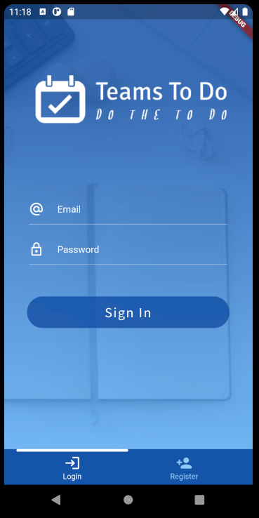
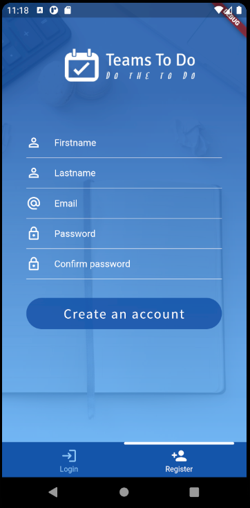
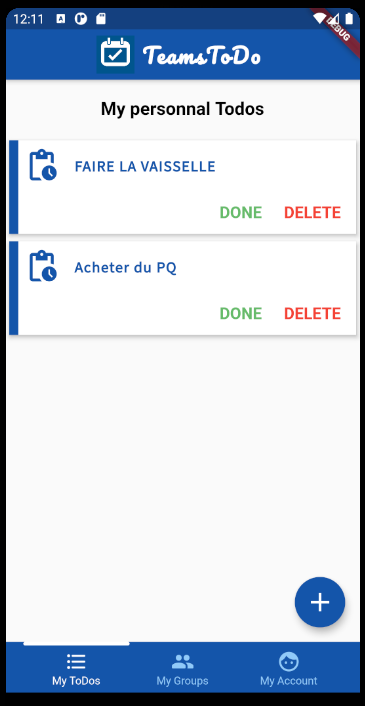
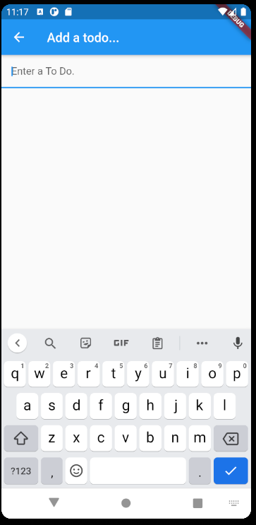
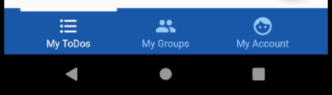

# TeamsTodo, a Flutter project

## Description du projet

Création d'une application Android & iOS pour faciliter la gestions de projet avec des groupes de personnes devant appliquer des ToDos.

> Participants du projet : Aboulicam Marvin (Mockinbrd), Castera Julien(JulienCASTERA), Lacoste Louis (Llacoste2000)

## Comment l'installer ?

### Pour les développeurs

Tout d'abord il vous faut installer Flutter ainsi que ses outils de développement.

cf : https://flutter.dev/docs/get-started/install

Les instructions changeant suivant votre système d'exploitation, nous préférons vous rediriger sur le site officiel.


Une fois ceci fait, vous devez cloner le projet.

```
git clone https://github.com/Llacoste2000/TeamsTodo-Project.git
cd TeamsTodo-Project
```

Nous vous invitons à ouvrir ce dossier avec votre éditeur (compatible Flutter ex. IntelliJ IDEA / Android Studio) pour construire le projet avec celui-ci.

Il existe toutefois un moyen de le lancer à la main, mais vous ne disposerez pas du debugger intégré à l'éditeur.

```
flutter run
```

Cette commande va ainsi construire l'application et la lancer soit sur votre simulateur (configuré au préalable) ou bien votre téléphone branché à votre ordinateur.


### Pour les consommateurs

L'application étant encore à l'état de prototype, elle n'est pas encore disponible sur les plateformes telles que Google Play ou Apple Store.

## Comment ça marche ?

Lorsque vous lancez l'application, vous arrivez sur un écran d'authentification avec pour choix la connexion ainsi que l'inscription.

<p align="center">
  
  
</p>

Une fois connecté / inscrit, vous arrivez sur vos todolist personnelles que vous pourrez créer directement avec le petit bouton + en bas à droite de votre écran.

<p align="center">
  
  
</p>


Vous disposez d'une barre de navigation en bas de l'écran pour naviguer entre les différents écrans de l'application.
<p align="center">
  
</p>

